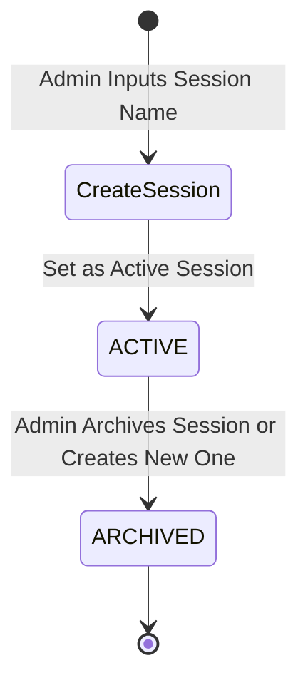

# FYC — Find Your Crew: Admin Control Room Specification

This document specifies the admin dashboard design, state transitions, operations, exception-handling buttons, and session lifecycle management under a strict group-of-4 policy.

---

## 1. Event State Machine Admin Operations

The administrator drives the active activity session. Below are the corresponding dashboard controls for each state:

| Active State | Actions & Controls Available | Client Rendering Effect |
| :--- | :--- | :--- |
| **LOBBY** | <ul><li>Show real-time session participant check-in counters.</li><li>Click `Start Activity` to transition to `QUESTION_1`.</li></ul> | Student: waiting screen. Projector: welcome QR code. |
| **QUESTION_X** *(X = 1..5)* | <ul><li>Show timer controls (Pause, Extend +30s).</li><li>Show live response bar (e.g. "340 / 350 Answered").</li><li>Click `Lock Responses` to close submissions.</li><li>Click `Next Stage` to transition to next question (or `MATCHING`).</li></ul> | Student: A/B/C/D buttons. If timer expires or locked, show "Answer Locked". Projector: play video, then show question. |
| **MATCHING** | <ul><li>**Cutoff Action:** Click `Lock Eligibility` (sets `ELIGIBLE`, `STANDBY`, `INACTIVE` statuses for the session).</li><li>Review counts: Active Eligible ($N'$), Standbys ($R$). Optional: manually swap standby and eligible students.</li><li>Click `Run Matching Engine` (runs deterministic matching algorithm on eligible cohort).</li><li>Show progress spinner ("Calculating groups...").</li><li>Click `Reveal Crews` to advance to `GROUP_REVEAL`.</li></ul> | Student: loading spinner. Standby users see standby notice. Projector: matching animation. |
| **GROUP_REVEAL** | <ul><li>Show count of formed groups (all size 4).</li><li>Monitor physical verification progression (e.g. "45 / 80 Groups Assembled").</li><li>Click `Enable Group Chat` to advance to `GROUP_CHAT` and enable chat logs.</li></ul> | Student: shows Crew Code (e.g., `AP-47`) and check-in button. Projector: display cohort lists/directions. |
| **GROUP_CHAT** | <ul><li>Monitor active chat threads.</li><li>View reported messages list; option to delete flagged messages.</li><li>Click `End Session` to advance to `COMPLETED`.</li></ul> | Student: unlocks text box to send messages (only if group's `chat_enabled = TRUE`). Projector: display completed stats, transition to pitch. |
| **COMPLETED** | <ul><li>Click `Create New Session` (opens registration for a new wave/test, archiving current session).</li></ul> | Student: displays Appirates registration link. Projector: Appirates pitch slide deck. |

---

## 2. Non-Destructive Session Lifecycle

To support testing, rehearsals, and the main event without deleting historical results, FYC implements a structured session lifecycle.

* **Default Lifecycle:** Starting a new run does not delete existing data. The admin clicks `Create New Session` (which sets the previous active session to `ARCHIVED` status). All incoming students scan the QR code and are registered under this new `session_id`.
* **Historical Audit:** Archived session databases remain fully intact, allowing the organizers to audit response graphs, matching success rates, and chat logs post-event.
* **Development/Emergency Reset:** A separate `Hard Reset` button is provided in developer settings, requiring double-confirmation, which physically deletes records for the *current* session only.

---

## 3. Exception Handling & Manual Controls

### 3.1 Eligibility Cutoff Approval Panel
When the admin clicks `Lock Eligibility` under the `MATCHING` state:
1. The database flags inactive users (those who did not submit any options).
2. The remaining users are counted. The youngest $R = N \pmod 4$ participants are set to `STANDBY` status.
3. The dashboard displays:
   * **Eligible Cohort Size:** $N' = N - R$ (must be divisible by 4).
   * **Standby List:** Renders the $R$ standby students' names and registration order.
   * **Adjust Eligibility:** The admin can select a standby student and swap them with an eligible student if a student was put on standby mistakenly.
4. Once reviewed, the admin clicks `Confirm & Run Matching`.

### 3.2 Force Check-in
Admin can search any participant by name and click `Force Check-in`. This writes `verified_at = NOW()` to their `group_members` row, helping students who lost internet access or ran out of battery.

### 3.3 Manual Group Merger
The admin dashboard contains a list of incomplete groups (where fewer than 4 members checked in).
* The admin selects Group A and Group B, and clicks `Merge Crews`.
* The system deletes the two old groups and creates a new group code (e.g. `AP-99`) containing the 4 remaining participants, pushing the update instantly to their mobile screens.

### 3.4 Deterministic Rematch
If new students register right after matching begins, the admin can add them to the session, re-run `Lock Eligibility` (which calculates a new cutoff), and click `Rematch`. Because matching uses a seeded PRNG, the grouping results remain stable and only shift to incorporate the new changes.
