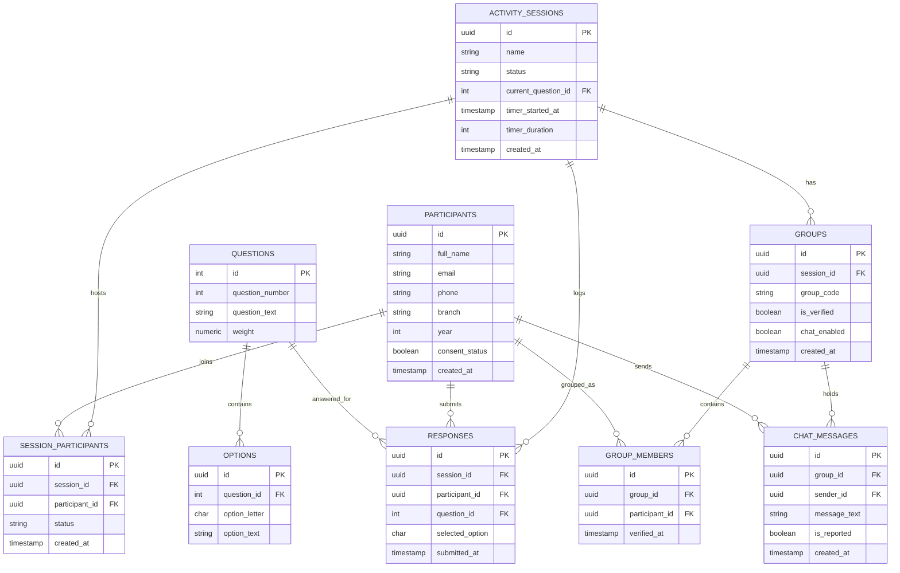

# FYC — Find Your Crew: Database Design Specification

This document defines the schema, relationships, indexes, constraints, and operational triggers for the PostgreSQL database, supporting the multi-session layout and strict group-of-4 policy.

---

## 1. Entity Relationship Diagram

The core entities model multiple activity sessions. Participants registers globally, but are bound to individual sessions through a participation state. Ephemeral groups, responses, and chat messages are segmented by session.



---

## 2. Table Definitions

### 2.1 Table: `activity_sessions`
Captures separate runs (e.g., Development Test, Rehearsal, Orientation Day) of the event.
```sql
CREATE TABLE public.activity_sessions (
    id UUID PRIMARY KEY DEFAULT gen_random_uuid(),
    name VARCHAR(100) NOT NULL,
    status VARCHAR(30) NOT NULL DEFAULT 'LOBBY' CHECK (
        status IN ('LOBBY', 'QUESTION_1', 'QUESTION_2', 'QUESTION_3', 'QUESTION_4', 'QUESTION_5', 'MATCHING', 'GROUP_REVEAL', 'GROUP_CHAT', 'COMPLETED')
    ),
    current_question_id INTEGER, -- FK resolved below
    timer_started_at TIMESTAMPTZ,
    timer_duration INTEGER, -- in seconds
    created_at TIMESTAMPTZ NOT NULL DEFAULT NOW()
);
```

### 2.2 Table: `participants`
Global user profile, linking 1:1 with Supabase `auth.users`.
```sql
CREATE TABLE public.participants (
    id UUID PRIMARY KEY REFERENCES auth.users(id) ON DELETE CASCADE,
    full_name VARCHAR(100) NOT NULL,
    email VARCHAR(150) UNIQUE NOT NULL,
    phone VARCHAR(20) NOT NULL,
    branch VARCHAR(100) NOT NULL,
    year INTEGER NOT NULL CHECK (year BETWEEN 1 AND 5),
    consent_status BOOLEAN NOT NULL DEFAULT FALSE,
    created_at TIMESTAMPTZ NOT NULL DEFAULT NOW()
);
```

### 2.3 Table: `session_participants`
Links a participant to a specific session and tracks their eligibility/cutoff status.
```sql
CREATE TABLE public.session_participants (
    id UUID PRIMARY KEY DEFAULT gen_random_uuid(),
    session_id UUID NOT NULL REFERENCES public.activity_sessions(id) ON DELETE CASCADE,
    participant_id UUID NOT NULL REFERENCES public.participants(id) ON DELETE CASCADE,
    status VARCHAR(20) NOT NULL DEFAULT 'REGISTERED' CHECK (
        status IN ('REGISTERED', 'ELIGIBLE', 'STANDBY', 'INACTIVE')
    ),
    created_at TIMESTAMPTZ NOT NULL DEFAULT NOW(),
    UNIQUE (session_id, participant_id)
);
```

### 2.4 Table: `questions`
Global configure table for scenario questions.
```sql
CREATE TABLE public.questions (
    id SERIAL PRIMARY KEY,
    question_number INTEGER NOT NULL UNIQUE CHECK (question_number BETWEEN 1 AND 5),
    question_text TEXT NOT NULL,
    weight NUMERIC(3, 2) NOT NULL DEFAULT 1.00 CHECK (weight >= 0.00)
);

-- Add foreign key constraint to activity_sessions once questions is declared
ALTER TABLE public.activity_sessions 
ADD CONSTRAINT fk_sessions_current_question 
FOREIGN KEY (current_question_id) REFERENCES public.questions(id);
```

### 2.5 Table: `options`
Choices associated with questions.
```sql
CREATE TABLE public.options (
    id UUID PRIMARY KEY DEFAULT gen_random_uuid(),
    question_id INTEGER NOT NULL REFERENCES public.questions(id) ON DELETE CASCADE,
    option_letter CHAR(1) NOT NULL CHECK (option_letter IN ('A', 'B', 'C', 'D')),
    option_text TEXT NOT NULL,
    UNIQUE (question_id, option_letter)
);
```

### 2.6 Table: `responses`
Saves participant choices. Double submissions for the same question/session are prevented at database constraint level.
```sql
CREATE TABLE public.responses (
    id UUID PRIMARY KEY DEFAULT gen_random_uuid(),
    session_id UUID NOT NULL REFERENCES public.activity_sessions(id) ON DELETE CASCADE,
    participant_id UUID NOT NULL REFERENCES public.participants(id) ON DELETE CASCADE,
    question_id INTEGER NOT NULL REFERENCES public.questions(id) ON DELETE CASCADE,
    selected_option CHAR(1) NOT NULL CHECK (selected_option IN ('A', 'B', 'C', 'D')),
    submitted_at TIMESTAMPTZ NOT NULL DEFAULT NOW(),
    UNIQUE (session_id, participant_id, question_id)
);
```

### 2.7 Table: `groups`
Cohort records. Unique group codes are enforced per session.
```sql
CREATE TABLE public.groups (
    id UUID PRIMARY KEY DEFAULT gen_random_uuid(),
    session_id UUID NOT NULL REFERENCES public.activity_sessions(id) ON DELETE CASCADE,
    group_code VARCHAR(10) NOT NULL, -- E.g., 'AP-47'
    is_verified BOOLEAN NOT NULL DEFAULT FALSE,
    chat_enabled BOOLEAN NOT NULL DEFAULT FALSE,
    created_at TIMESTAMPTZ NOT NULL DEFAULT NOW(),
    UNIQUE (session_id, group_code)
);
```

### 2.8 Table: `group_members`
Links participants to their session group. A student can join at most one group per session.
```sql
CREATE TABLE public.group_members (
    id UUID PRIMARY KEY DEFAULT gen_random_uuid(),
    group_id UUID NOT NULL REFERENCES public.groups(id) ON DELETE CASCADE,
    participant_id UUID NOT NULL REFERENCES public.participants(id) ON DELETE CASCADE,
    verified_at TIMESTAMPTZ, -- Physical check-in timestamp
    UNIQUE (group_id, participant_id)
);
```

### 2.9 Table: `chat_messages`
Stores conversation logs.
```sql
CREATE TABLE public.chat_messages (
    id UUID PRIMARY KEY DEFAULT gen_random_uuid(),
    group_id UUID NOT NULL REFERENCES public.groups(id) ON DELETE CASCADE,
    sender_id UUID NOT NULL REFERENCES public.participants(id) ON DELETE CASCADE,
    message_text TEXT NOT NULL CHECK (char_length(message_text) <= 500),
    is_reported BOOLEAN NOT NULL DEFAULT FALSE,
    created_at TIMESTAMPTZ NOT NULL DEFAULT NOW()
);
```

---

## 3. Indexes & Optimization

We establish indexes on query filter columns to support rapid reads under high loads:
```sql
-- Index for lookups during matching optimization
CREATE INDEX idx_responses_session_lookup ON public.responses(session_id, participant_id);

-- Index for fetching chat messages ordered by time
CREATE INDEX idx_chat_group_time ON public.chat_messages(group_id, created_at DESC);

-- Index for resolving group codes during verification search
CREATE INDEX idx_group_code ON public.groups(session_id, group_code);
```

---

## 4. Automation Triggers

We write a database trigger to automatically set `is_verified = TRUE` on `groups` once all entries in `group_members` for that cohort contain a valid `verified_at` timestamp.

```sql
CREATE OR REPLACE FUNCTION public.check_group_verification()
RETURNS TRIGGER AS $$
DECLARE
    total_members INTEGER;
    verified_members INTEGER;
BEGIN
    -- Count total members in the group
    SELECT COUNT(*) INTO total_members
    FROM public.group_members
    WHERE group_id = NEW.group_id;

    -- Count members who have checked in
    SELECT COUNT(*) INTO verified_members
    FROM public.group_members
    WHERE group_id = NEW.group_id AND verified_at IS NOT NULL;

    -- If all members (exactly 4) have physically arrived, mark group as verified
    -- Note: Trigger only changes is_verified. Chat opening remains controlled by the admin.
    IF total_members = verified_members AND total_members = 4 THEN
        UPDATE public.groups
        SET is_verified = TRUE
        WHERE id = NEW.group_id;
    END IF;

    RETURN NEW;
END;
$$ LANGUAGE plpgsql;

CREATE TRIGGER trigger_update_group_verification
AFTER UPDATE OF verified_at ON public.group_members
FOR EACH ROW
EXECUTE FUNCTION public.check_group_verification();
```
