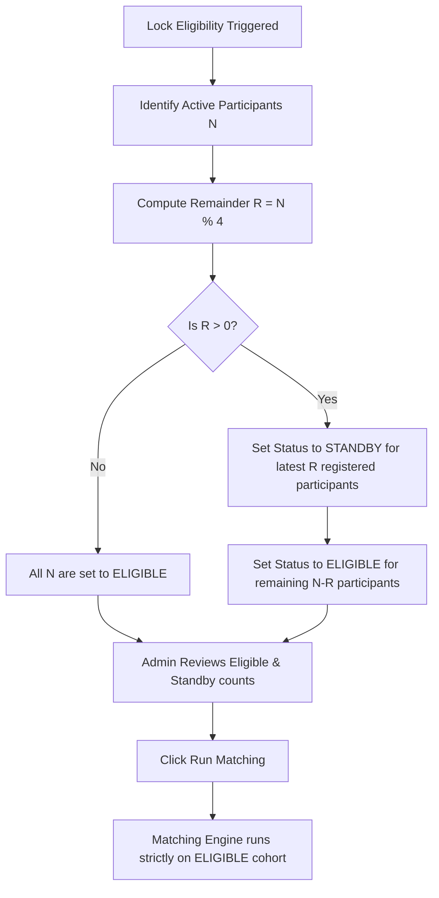

# FYC — Find Your Crew: Matching Engine Specification

This document details the algorithm, mathematical formulations, optimization goals, and edge case strategies for the **FYC Matching Engine**, enforcing a strict group-of-4 policy.

---

## 1. Response Representation

Every participant $p$ who completes the activity has a response vector:
$$R_p = [r_{p,1}, r_{p,2}, r_{p,3}, r_{p,4}, r_{p,5}]$$

where $r_{p,i} \in \{'A', 'B', 'C', 'D', \text{null}\}$. A $\text{null}$ represents a missed or skipped question.

---

## 2. Similarity Metric

The system supports configurable question weights. Let the weight vector be:
$$W = [w_1, w_2, w_3, w_4, w_5]$$

where $w_i \ge 0$. The default weight vector is $[1.0, 1.0, 1.0, 1.0, 1.0]$.

The compatibility score (similarity) $S(a, b)$ between participant $a$ and participant $b$ is computed as the weighted fraction of matching answers:

$$S(a, b) = \frac{\sum_{i=1}^5 w_i \cdot \mathbb{I}(r_{a,i} == r_{b,i} \land r_{a,i} \neq \text{null} \land r_{b,i} \neq \text{null})}{\sum_{i=1}^5 w_i}$$

where $\mathbb{I}(\text{condition})$ is the indicator function (returns $1$ if true, $0$ otherwise). If both participants skipped all questions, $S(a, b) = 0$.

---

## 3. Group Optimization Goal

Let $P'$ be the set of eligible participants selected for matching, where $|P'|$ is strictly divisible by 4. The goal is to partition $P'$ into disjoint groups $G = \{g_1, g_2, \dots, g_k\}$ where each $|g_i| = 4$, to maximize the global compatibility:

$$\text{Maximize } \sum_{g \in G} \text{intra\_group\_compatibility}(g)$$

For a group $g$ containing exactly 4 members, the intra-group compatibility is the sum of pairwise similarities between its members:

$$\text{intra\_group\_compatibility}(g) = \sum_{a, b \in g, a < b} S(a, b)$$

---

## 4. Heuristic Matching Algorithm

Finding the optimal partition of size-4 groups is NP-complete. For orientation events with $100$ to $500$ participants, the algorithm prioritizes **correctness, stability, and reliability**. The target completion time is **under a few seconds** (e.g. 1 to 3 seconds) under normal event conditions. During this calculation, the main stage projector displays a "Calculating Matches..." animation.

To execute efficiently, the engine uses a two-phase heuristic:

### Phase 1: Greedy Initialization
1. Sort eligible participants deterministically (e.g. alphabetically by UUID).
2. Select the first unmatched eligible participant $p$ from the list.
3. Find the 3 unmatched eligible participants that maximize the intra-group compatibility if grouped with $p$. Tie-breakers must use a deterministic comparison (e.g., matching the lowest UUID).
4. Form a group of exactly 4, mark them as matched, and repeat until all eligible participants in $P'$ are grouped.

### Phase 2: Local Search (Hill Climbing)
1. Run $I = 5000$ iterations of swaps.
2. In each iteration:
   * Select two groups $g_x$ and $g_y$ deterministically using our seeded PRNG.
   * Select a participant $a \in g_x$ and $b \in g_y$ using the seeded PRNG.
   * Calculate the net change in compatibility if $a$ and $b$ swap groups ($\Delta$).
   * If $\Delta > 0$, execute the swap.

---

## 5. Deterministic Matching Execution (Seeded PRNG)

To avoid uncontrolled randomness (where identical response datasets produce different group outcomes on successive matching runs), all random-choice functions in the greedy selection and local search swap phases are replaced with a **seeded Pseudo-Random Number Generator (PRNG)**.

### Seed Generation
The seed is generated by hashing the current `session_id` UUID combined with a fixed application-wide constant string:
$$\text{seed} = \text{Hash}(\text{session\_id} + \text{"AP\_FYC\_SEED\_CONST"})$$

### Implementation
We implement a lightweight PRNG (such as the LCG or Mulberry32 algorithm) initialized with this seed. 
* All shuffles, random selections of swap groups, and swap candidate index selections query this seeded generator instead of `Math.random()`.
* **Consequence:** Running the matching engine multiple times on the same input dataset will yield identical groups. A different set of groups is generated only if:
  1. The response dataset changes (e.g., late registrants are added).
  2. The admin explicitly initiates a different session or modifies question weights.
  3. The admin manually requests a rematch using a modified seed modifier.

---

## 6. Participant Count Edge Cases ($N \% 4 \neq 0$)

The system enforces an **Eligibility Cutoff Mechanism** before running the matching engine to guarantee groups of exactly 4. 

### Eligibility Cutoff Rules:
1. **Standby Identification:** The system calculates $R = N \pmod 4$. If $R > 0$, the $R$ latest registered participants (ordered by `created_at` in the `session_participants` table) are automatically set to `STANDBY` status.
2. **Review Panel:** The Admin dashboard displays the count of eligible students ($N' = N - R$) and the names of the $R$ standby students. The admin has the override capability to manually swap a standby student with an eligible student (updating their statuses) before running the matching.
3. **Execution:** The matching engine queries only participants whose status in `session_participants` is set to `ELIGIBLE`. 

---

## 7. Failure and Exception Policies

### 7.1 Standby Participant Handling
Standby participants are placed on a waitlist. Their mobile interface displays a custom message advising them to report to the Appirates help desk. The admin can manually assign them as "crew observers" or place them in manual groupings post-reveal.

### 7.2 Incomplete Groups (Event Day Dropouts)
If a student leaves early after groups are created, the admin uses the **`Merge Crew`** tool to merge two incomplete groups (e.g. 2 checked-in members each) into a new group of 4.
