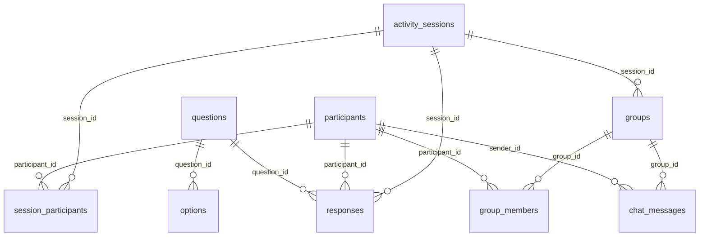
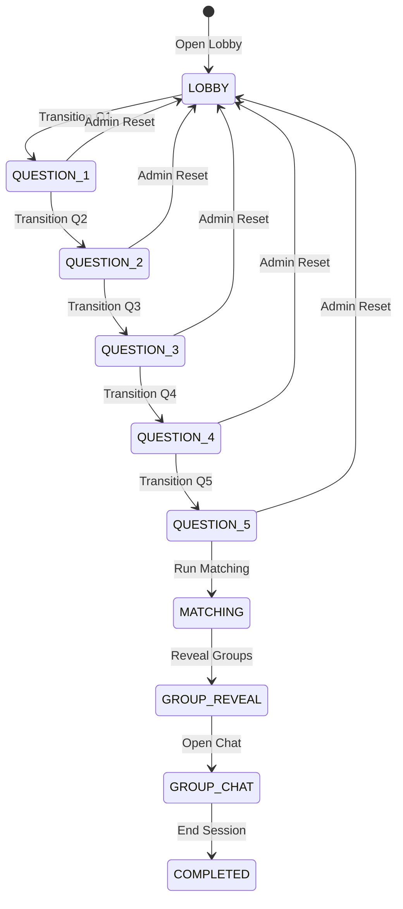

# FYC — Find Your Crew: Engineering Handoff & Context Document

This document serves as the single source of truth for the **FYC — Find Your Crew** project. It provides all architectural context, database schema definitions, security logic, current implementation status, and testing workflows required for any incoming developer or AI coding agent to continue development without redundant research or accidental regression.

---

## 1. Project Overview

**FYC — Find Your Crew** is an interactive, real-time web application designed to match orientation students into optimal cohorts (target size of 4) based on their responses to five distinct scenario-based questions. The application consists of three primary user experiences:
1. **Student Experience:** Students sign up, complete registration details with consent, wait in a real-time lobby, answer scenario questions before timers expire, receive their matched crew assignment, physically meet their crew, check-in using their group code, and finally communicate via a secure, ephemeral group chat.
2. **Admin Experience (Control Room):** Event administrators manage the session lifecycle, transition states (LOBBY → QUESTIONS → MATCHING → REVEAL → CHAT), monitor real-time metrics (registered count, completed answers, check-ins), trigger the deterministic matching engine, and open the crew group chat.
3. **Projector View:** Displays live counts, timers, scenario content, and real-time verification stats to the entire hall during the event.

### Target Objectives & Event Lifecycle
```
Lobby Open → Registration → Scenarios (Q1-Q5) → Run Matching → Reveal Crew → Handshake/Verify → Ephemeral Chat
```

---

## 2. Current Development Status

The project is structured in stages. Stages **10.3A through 10.3F** are fully completed, database-validated, and verified against a staging Supabase environment. **Do not modify or rebuild these completed stages.**

### Implementation Stage Matrix

| Stage | Focus Area | Status | Notes |
| :--- | :--- | :--- | :--- |
| **10.3A** | Database Foundation | ✅ PASS | Schema, tables, relationships, and basic constraints |
| **10.3B** | Registration & Security | ✅ PASS | Global profiles, session registration, RLS policies |
| **10.3C** | Questions & Responses | ✅ PASS | Seeds, response locking, response immutability |
| **10.3D** | Matching Engine | ✅ PASS | Greedy initialization, Local Search optimization, RPC persistence |
| **10.3E** | Group Reveal | ✅ PASS | Crew assignment lookup, Lobby WebSocket redirection |
| **10.3F** | Physical Verification | ✅ PASS | Check-in verification, DB trigger automatic verification check |
| **10.3G** | Realtime + Chat | ▶️ NEXT | Real-time chat messaging, WebSocket updates |
| **10.3H** | Admin + Projector | ⏳ PENDING | Projector presentation screens, visual telemetry |

---

## 3. Technology Stack

* **Frontend & Server Components:** Next.js (v16.3.1) App Router, React (v19.2.8), and TypeScript.
* **Database & BaaS:** Supabase (PostgreSQL) with Row Level Security (RLS) and database triggers.
* **Real-time Engine:** Supabase Realtime Channels (PostgreSQL WAL replication over WebSockets).
* **Authentication:** Supabase Auth (connecting client side to Supabase OAuth / email-password logins).
* **Styling:** Tailwind CSS (v4) with custom theme tokens.
* **Package Manager:** npm.

---

## 4. Project Structure

```
.
├── app/                           # Next.js App Router root
│   ├── admin/                     # Admin control room routes
│   │   ├── dashboard/             # Console Dashboard Client, states & transitions
│   │   └── login/                 # Supabase Auth email/password admin login
│   ├── auth/                      # Redirect callbacks and auth utilities
│   ├── student/                   # Student portal routes
│   │   ├── activity/              # Main student activity console & chat room
│   │   ├── register/              # Student sign-up form & consent
│   │   └── waiting/               # Realtime wait room redirection lobby
│   ├── layout.tsx                 # Root layout (HTML wrapper & fonts)
│   └── page.tsx                   # Entrance page (redirects to admin/student)
├── components/                    # Shared React components
│   └── ui/                        # Low-level UI design tokens (Card, Button, Input, Badge)
├── lib/                           # Global business logic utilities
│   ├── matching/                  # Core deterministic matching engine files
│   │   ├── compatibility.ts       # Pair-wise score calculations
│   │   ├── engine.ts              # Orchestrates candidate retrieval, matching, and persistence
│   │   ├── grouping.ts            # Greedy initialization and Local Search optimizer
│   │   ├── prng.ts                # Seed-based pseudo-random generator
│   │   └── validator.ts           # Post-match group bounds validation
│   └── supabase/                  # SSR and Browser Supabase client builders
├── scripts/                       # Local development / rehearsal helper scripts
├── supabase/
│   └── migrations/                # Chronological SQL database migrations
└── types/                         # TypeScript interfaces (Question, Option, Group, Member)
```

---

## 5. How to Run the Project

### 1. Prerequisites
Ensure you have Node.js (v20+) installed.

### 2. Dependency Installation
```bash
npm install
```

### 3. Environment Configuration
Create a `.env.local` file in the project root with your Supabase credentials:
```env
NEXT_PUBLIC_SUPABASE_URL=https://your-project.supabase.co
NEXT_PUBLIC_SUPABASE_ANON_KEY=eyJhbGciOiJIUzI1NiIsInR5cCI6IkpXVCJ9...
SUPABASE_SERVICE_ROLE_KEY=eyJhbGciOiJIUzI1NiIsInR5cCI6IkpXVCJ9...
```

### 4. Running the Development Server
```bash
npm run dev
```
Open [http://localhost:3000](http://localhost:3000) to access the application.

### 5. Standard Route Entrypoints
* **Student Landing:** `http://localhost:3000/` (automatically routes to register or waiting room)
* **Admin Login:** `http://localhost:3000/admin/login`
* **Admin Control Room:** `http://localhost:3000/admin/dashboard`
* **Projector View:** `http://localhost:3000/projector`

### 6. Production Compiling
```bash
npm run build
```

---

## 6. Environment Variables

The project utilizes three environment variables. Public variables are prefix-protected so they can safely bind to the client side.

* `NEXT_PUBLIC_SUPABASE_URL` *(Public)*: Your Supabase API endpoint.
* `NEXT_PUBLIC_SUPABASE_ANON_KEY` *(Public)*: Anonymous key for low-privilege client operations under RLS.
* `SUPABASE_SERVICE_ROLE_KEY` *(Secret)*: Bypasses RLS policies. **Never expose this on the client or include it in client-side bundles.**

---

## 7. Authentication Flow

### Student Authentication
* Managed via Supabase Auth (typically Google OAuth or authenticated emails).
* Successful authentication maps 1:1 with an ID entry in the `participants` table.
* The authenticated session determines user-isolation RLS parameters.

### Admin Authentication
* Admin login is served at `/admin/login` using Supabase Auth password verification.
* Role-based access control is enforced. The designated administrator email is **`neemay.gupta1212@gmail.com`**.
* The server-side checks and client router inspect the user’s token payload:
  `user.app_metadata.role === 'admin'`
* Merely hiding the UI components is not considered sufficient; admin functions in `app/admin/dashboard/actions.ts` explicitly run server-side database checks calling the `is_admin()` RPC to prevent unauthorized execution of matching or state overrides.

---

## 8. Database Architecture



### Table Specifications

#### 1. `activity_sessions`
Tracks individual session events (e.g. rehearsal runs vs live events).
* `id` (UUID, PK)
* `name` (VARCHAR)
* `status` (VARCHAR, CHECK: LOBBY, QUESTION_1..5, MATCHING, GROUP_REVEAL, GROUP_CHAT, COMPLETED)
* `current_question_id` (INTEGER, FK to questions)
* `timer_started_at` (TIMESTAMPTZ)
* `timer_duration` (INTEGER)

#### 2. `participants`
Extends default Supabase profiles.
* `id` (UUID, PK, FK to auth.users)
* `full_name` (VARCHAR)
* `email` (VARCHAR, UNIQUE)
* `consent_status` (BOOLEAN)

#### 3. `session_participants`
Links students to sessions and determines matching eligibility.
* `session_id` (UUID, FK, composite UNIQUE with participant_id)
* `participant_id` (UUID, FK)
* `status` (VARCHAR, CHECK: REGISTERED, ELIGIBLE, STANDBY, INACTIVE)

#### 4. `questions` & `options`
Quiz coordinates.
* `questions`: `id` (SERIAL, PK), `question_number` (INT), `question_text` (TEXT), `weight` (NUMERIC)
* `options`: `id` (UUID, PK), `question_id` (FK), `option_letter` (CHAR), `option_text` (TEXT)

#### 5. `responses`
Answers submitted. Immutable under RLS (no student updates/deletes permitted).
* `session_id` (UUID, FK, composite UNIQUE with participant_id and question_id)
* `participant_id` (UUID, FK)
* `question_id` (INTEGER, FK)
* `selected_option` (CHAR)

#### 6. `groups` & `group_members`
Cohort assignments.
* `groups`: `id` (UUID, PK), `group_code` (VARCHAR), `is_verified` (BOOLEAN), `chat_enabled` (BOOLEAN)
* `group_members`: `id` (UUID, PK), `group_id` (UUID, FK), `participant_id` (UUID, FK), `is_checked_in` (BOOLEAN), `checked_in_at` (TIMESTAMPTZ)

#### 7. `chat_messages`
Logs ephemeral student communications. Added to the `supabase_realtime` publication.
* `id` (UUID, PK)
* `group_id` (UUID, FK)
* `sender_id` (UUID, FK)
* `message_text` (TEXT, check length <= 500)

---

## 9. Migration History

1. **`20260816000000_initial_schema.sql`**: Setup of tables, base relationships, indexes, and low-level RLS policies.
2. **`20260816000002_seed_questions.sql`**: Seeds the 5 scenario questions and 4 option vectors (A, B, C, D) per question.
3. **`20260816000003_persist_matching_rpc.sql`**: Creates the `persist_matching(p_session_id, p_groups)` database function. This runs atomically in a transaction to purge old matches and insert new ones.
4. **`20260816000005_crew_verification_trigger.sql`**: Configures the initial `check_group_verification_trigger` database function and maps it to update events on `group_members` to verify groups. Enabled replication tables.
5. **`20260816000006_chat_security_rls.sql`**: Restricts chat messages access (read/write) only to students belonging to that group, and only when `is_verified = TRUE` and `chat_enabled = TRUE`.
6. **`20260816000007_concurrency_and_immutability.sql`**: Row locking function `transition_session_status()` to prevent race conditions during transitions, and trigger `tr_enforce_group_members_immutability` to block editing of group mappings once persisted.
7. **`20260816000008_response_immutability_rls.sql`**: Forces RLS even for table owners on `responses`, revoking PostgreSQL UPDATE/DELETE privileges from anon/authenticated roles.
8. **`20260816000009_fix_group_members_rls.sql`** *(CRITICAL PATCH)*: Migration 05 introduced `is_checked_in` boolean flags, but the check-in RLS policies were still checking the legacy `verified_at` column. This RLS policy patch corrects this discrepancy, resolving error code `42501` (RLS violation) during student check-ins.
9. **`20260816000010_admin_auto_role.sql`**: Database trigger automatically setting app metadata `role: admin` on user creation if email matches `neemay.gupta1212@gmail.com`.
10. **`20260816000011_flexible_group_verification.sql`**: Modifies the `check_group_verification_trigger` function to compare `v_count = v_total` (checked-in members vs total group size) rather than checking for a static size of 4, supporting custom group sizing in rehearsal mode.
11. **`20260816000012_realtime_sessions.sql`**: Adds `activity_sessions` to the `supabase_realtime` publication to support live waiting-room redirection.
12. **`20260816000013_realtime_chat.sql`**: Adds `chat_messages` to the `supabase_realtime` publication to broadcast messages.

---

## 10. Complete Student Journey Flow

```
[Authenticate] ──> [Register (Consent)] ──> [Waiting Room]
                                                 │ (Real-time redirect)
[Matched Crew] <── [Scenario Answers] <──────────┘
      │
[Handshake (Check-in Code)] ──> [All Members Verified] ──> [Unlocked Chat]
```

1. **Auth & Setup:** Student signs in, enters details, and registers for the active session.
2. **Waiting Room:** If session status is `LOBBY`, the student waits. When the status changes to `QUESTION_1`, a WebSocket broadcast triggers the page to automatically redirect the student to the active question screen.
3. **Answering:** Student sees the current question scenario and 4 options. They select an option, which is persisted.
4. **Locking:** After Q5 timer completes, answers are locked. The student is placed in a waiting state.
5. **Matching:** The Admin runs the matching engine. The student's group assignment is resolved.
6. **Reveal & Verification:** Admin transitions state to `GROUP_REVEAL`. The student sees their crew code (e.g. `AP-01`) and is prompted to find their teammates.
7. **Check-in:** The student inputs the code `AP-01`. The backend checks that it matches their group.
8. **Realtime Unlock:** Once all teammates check in, the database trigger automatically updates `is_verified` and `chat_enabled` to `TRUE`. The student UI transitions to wait for the chat phase.
9. **Chat:** Admin opens chat (`GROUP_CHAT` state). The student can read and send messages in real-time.

---

## 11. Admin Console & State Machine

The session moves forward through a strict state progression managed by the administrator.



* **Transition Rule:** Resetting back to `LOBBY` is allowed from any question state to support rehearsal testing and restarts.

---

## 12. Matching Engine & Rehearsal Mode

* **Code Location:** Core algorithms reside in [`lib/matching/`](file:///Users/neemaysmac/Desktop/FYC/lib/matching/).
* **Deterministic Matching:** Uses a pseudo-random seed to group candidates using a greedy initialization strategy, followed by a Local Search (2-swap optimizer) to maximize compatibility scores.
* **Database Persistence:** Executed via `runMatchingEngine()`, which writes results atomically using the `persist_matching` RPC.

### Rehearsal Mode (Single-Participant Test Flow)
To test the complete workflow locally without needing exactly 4 participants, the matching engine supports **Rehearsal Mode**:
* **Activation:** Enabled automatically if the session name includes `"rehearsal"`, `"test"`, or `"demo"`, or if `process.env.NODE_ENV === 'development'`.
* **Lower Bound:** Relaxes the minimum completed candidates threshold from `4` to `1`.
* **Remainder Logic:** Remainder checks are bypassed (`R = 0`) if candidates < 4.
* **Verification Trigger:** Bypasses static checks for size 4, checking if checked-in members equal the total group size. A single participant inputting their crew code will instantly verify their group and unlock their chat window.

---

## 13. Physical Verification & Security Guarantees

### Check-in Validation Logic
Verification occurs when the student enters their crew code in `/student/activity`.
* **Database Security (RLS):** Policies prevent students from updating others' check-in status or modifying group attributes (`is_verified` or `chat_enabled`) directly.
* **Database Trigger Integration:** The verification status update triggers `check_group_verification_trigger()`, checking if `checked_in_count = group_size`. If met, it sets:
  `groups.is_verified = TRUE` & `groups.chat_enabled = TRUE`

### Security Guarantees
1. **Student Isolation:** Students can only read and write messages in their own group's chat.
2. **Response Immutability:** Once submitted, responses cannot be updated or deleted by students (enforced at the database levels).
3. **Cross-Group Prevention:** Group check-in coordinates are audited on the server side to ensure students cannot check into groups they do not belong to.

---

## 14. Stage 10.3F Test Status

The system validation results for Stage 10.3F:

* **Setup matched session (N=8):** PASS
* **Transition to GROUP_REVEAL:** PASS
* **Initial verification state:** PASS
* **Valid verification progression:** PASS
* **Automatic group verification trigger:** PASS
* **Invalid group code tests:** PASS
* **Unauthorized/cross-group check-in:** PASS
* **Duplicate check-in:** PASS
* **Session/state boundaries:** PASS
* **Verification immutability:** PASS
* **Second group verification:** PASS
* **Database integrity:** PASS
* **Production compilation (`npm run build`):** PASS

*Note: Realtime WebSocket message streaming is scheduled for verification in Stage 10.3G.*

---

## 15. Next Development Target: Stage 10.3G

The next stage of development focuses on **Stage 10.3G: Realtime + Chat**.

### Key Objectives
* Ensure real-time chat subscriptions connect and receive database message inserts.
* Confirm that RLS policies for `chat_messages` permit SELECT/INSERT updates without error.
* Implement client-side optimistic updates to provide a responsive interface.
* Verify message delivery is securely isolated between group members.

---

## 16. Important Code Map

| File | Purpose | Notes |
| :--- | :--- | :--- |
| [`lib/matching/engine.ts`](file:///Users/neemaysmac/Desktop/FYC/lib/matching/engine.ts) | Core orchestrator for the matching engine. | Evaluates rehearsal vs production rules. |
| [`app/student/activity/ActivityConsole.tsx`](file:///Users/neemaysmac/Desktop/FYC/app/student/activity/ActivityConsole.tsx) | Student console, countdown timer, options render, chat client. | Contains the Realtime subscription and optimistic chat updates. |
| [`app/admin/dashboard/DashboardConsoleClient.tsx`](file:///Users/neemaysmac/Desktop/FYC/app/admin/dashboard/DashboardConsoleClient.tsx) | Admin dashboard view and state control panel. | Triggers matching calculations and state transitions. |
| [`app/student/activity/chatActions.ts`](file:///Users/neemaysmac/Desktop/FYC/app/student/activity/chatActions.ts) | Server Action to send/retrieve chat messages. | Enforces session status checks, rate-limiting, and validation. |
| [`supabase/migrations/20260816000009_fix_group_members_rls.sql`](file:///Users/neemaysmac/Desktop/FYC/supabase/migrations/20260816000009_fix_group_members_rls.sql) | RLS patch file. | Fixes RLS policies for `group_members` check-ins. |

---

## 17. Debugging Guide

### 1. "Insufficient completed participants to match"
* **Cause:** The number of candidates with 5 completed responses is below the minimum threshold (4 for production, 1 for rehearsal).
* **Fix:** Ensure the session name includes `"rehearsal"` or `"test"` to run in Rehearsal Mode, or confirm that at least 4 participants have completed all 5 scenarios.

### 2. "42501 RLS policy violation during check-in"
* **Cause:** Update queries to `group_members` fail security checks.
* **Fix:** Confirm that `20260816000009_fix_group_members_rls.sql` is applied. The trigger updating `group_members` must write `is_checked_in = TRUE` matching the RLS policy.

### 3. Student sees waiting room indefinitely
* **Cause:** Realtime listener for state changes failed or the table was not added to replication.
* **Fix:** Confirm the table is in `supabase_realtime` and refresh the page.

---

## 18. Development Rules for Future AI Agents

1. **Review this file** before editing code.
2. **Never disable RLS** or downgrade database security checks.
3. **Do not modify completed stages (10.3A–10.3F)** unless fixing a documented bug.
4. **Use Rehearsal Mode** for single-person local testing. Do not replace production checks with static logic.
5. **Always compile production bundle (`npm run build`)** to verify TypeScript and build compilation success.
