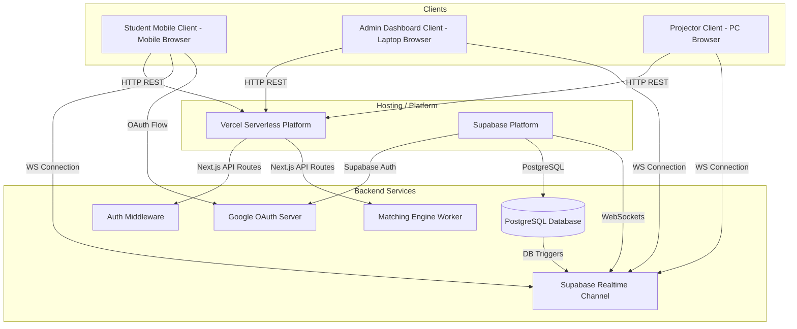

# FYC — Find Your Crew: System Architecture Spec

This document details the software and hardware system architecture for **FYC — Find Your Crew**.

---

## 1. System Topology

FYC utilizes a client-server architecture with a shared cloud backend. Clients (Students, Admin, and Projector) interact with the backend via RESTful APIs and establish a WebSocket connection for real-time state changes.

---

## 2. Technical Stack Recommendation

Given the high reliability, single-day event nature, and need for fast development cycles, we recommend the following stack:

| Component | Technology | Rationale |
| :--- | :--- | :--- |
| **Frontend Framework** | Next.js (React) | File-based routing, serverless API routes, excellent performance, and developer ergonomics. |
| **Styling** | Tailwind CSS | Rapid UI building, responsive utility classes for mobile browsers, light/dark mode. |
| **Database** | PostgreSQL (Supabase) | Robust relational modeling, indexes, foreign keys, and atomic operations. |
| **Real-time Engine** | Supabase Realtime | Out-of-the-box PostgreSQL listen/notify replication over WebSockets; eliminates custom socket server maintenance. |
| **Authentication** | Supabase Auth (Google OAuth) | Secure login tokens, Google integration, handles sessions and metadata, integrates with PostgreSQL RLS. |
| **Hosting & Deployment** | Vercel | Seamless Next.js deployment, edge optimization, instant rollbacks. |

---

## 3. Real-Time Synchronization Patterns

To prevent heavy database polling, FYC implements a real-time event-driven synchronization architecture:

### 3.1 Session State Broadcast
* **State Table (`activity_state`):** Holds a single row representing the active orientation stage (e.g., `state: 'QUESTION_2'`, `timer_expires_at: '2026-08-16T10:35:00Z'`).
* **Subscription:** All Student and Projector clients subscribe to changes on `activity_state` via Supabase Realtime.
* **Transition:** When the admin changes the state, Supabase broadcasts the update. Student clients immediately re-render to display the corresponding interface (e.g., show Option buttons A/B/C/D).
* **Cutoff Synchronization:** When the admin locks eligibility, the system updates the `participants` statuses. Student devices read their updated profile status:
  * If `status == 'STANDBY'`, the client renders the Standby notice.
  * If `status == 'ELIGIBLE'`, the client renders the matching wait page, followed by their group code.

### 3.2 Ephemeral Group Chat Messaging
* **Message Table (`chat_messages`):** Rows represent individual chat messages containing `group_id`, `sender_id`, `message_text`, and `timestamp`.
* **Subscription:** The Student client subscribes to a filtered realtime stream: `chat_messages?group_id=eq.{my_group_id}`.
* **Security:** Supabase Row Level Security (RLS) ensures that only authenticated students belonging to that specific `group_id` receive these messages over the WebSocket.

---

## 4. Sub-System Responsibilities

### 4.1 Student Mobile Client
* Zero video players or streaming: Renders small text, lightweight vector graphics, option buttons, group codes, and a chat interface.
* Optimized for cell networks or basic guest Wi-Fi (compressed state payloads).

### 4.2 Projector Presentation View
* Dual monitor layout: Renders full-screen web views to the main projector.
* Pulls dynamic state from the sync channel.
* Plays pre-rendered MP4/WebM video files hosted on a content delivery network (CDN) or local storage to minimize backend CPU loading.

### 4.3 Admin Control Room
* Heavy desktop dashboard.
* Visualizes real-time metrics (registrations count, locked answers progress bar, verification rates).
* Restricts access using JWT tokens checking metadata for `role = 'admin'`.
