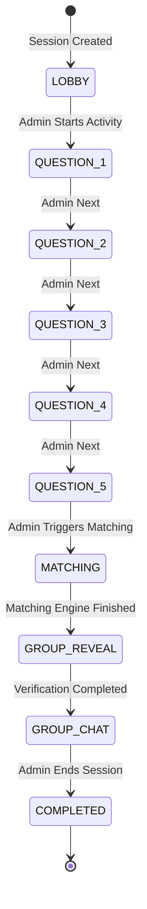
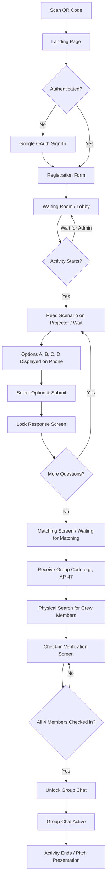
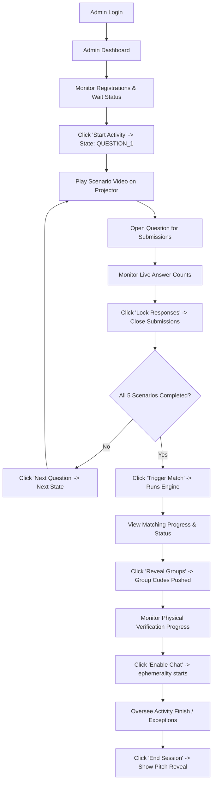
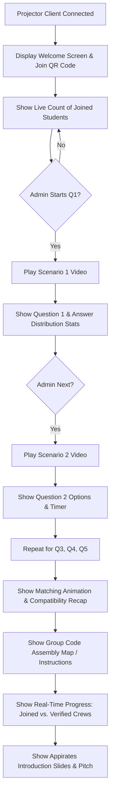
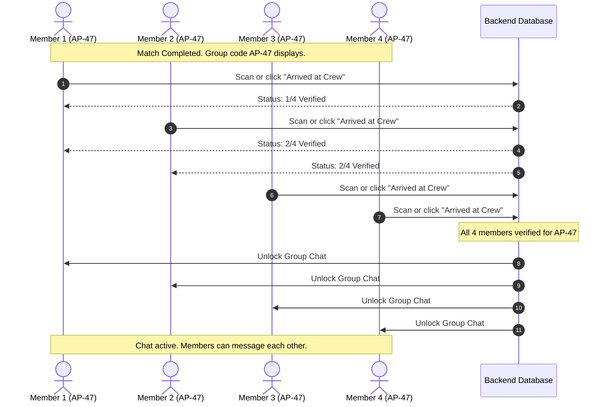

# FYC — Find Your Crew: User Flow Specification

This document maps the user flows for the three primary interfaces of the **FYC — Find Your Crew** experience: the **Student Mobile App**, the **Admin Dashboard**, and the **Main Stage Projector**.

---

## 1. Global Activity States

The entire application moves through a single synchronized state machine. The admin advances this state machine, causing all connected student devices and the projector to update in real-time.

---

## 2. Student Flow

The student experiences FYC entirely on their mobile browser after scanning a QR code.

---

## 3. Admin Flow

The admin has a control dashboard to drive the state machine and handle live issues.

---

## 4. Projector Flow

The projector screen runs on a dedicated machine connected to the auditorium's display system. It acts as the visual focus of the event.

---

## 5. Group Verification & Chat Flow

Students must physically gather to confirm their group of 4.

